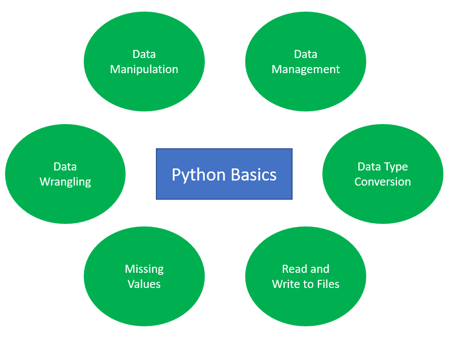
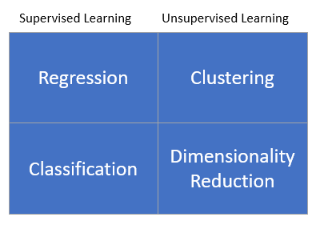
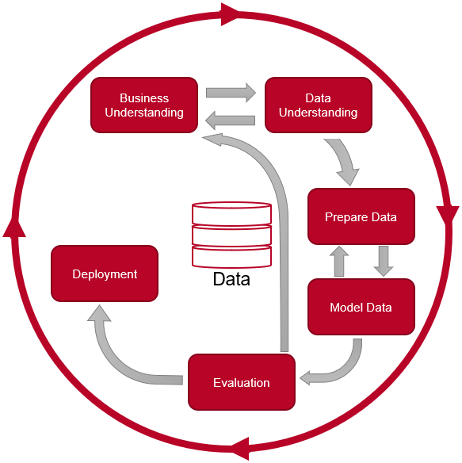

# Bdown-Python

This is a blog post using Python.

URL: https://michael-fuchs-python.netlify.com/

I am an enthusiastic Data Scientist with a strong passion for Machine Learning in particular for Deep Learning.
Over the years, I have worked in various areas of the field of artificial intelligence. 
All this knowledge I have collected and reproduced in publications.
I have collected these posts in the present repository and published them via Netlify. 

Via my [Tag Archive](https://michael-fuchs-python.netlify.app/2019/01/01/tag-archive/) you can get a quick overview of the topics I'm dealing with and get into the respective posts via the links provided. 

I started with a simple introduction to pyhton:

Afterwards I dealt intensively with the fields of Machine Learning:

In my posts about the use of the discussed machine learning algorithms within the different analysis fields I showed real life case studies and how to solve real problems or build solutions with modern algorithms. 
In doing so, I strongly followed the CRISP-DM model.

Enjoy reading !

